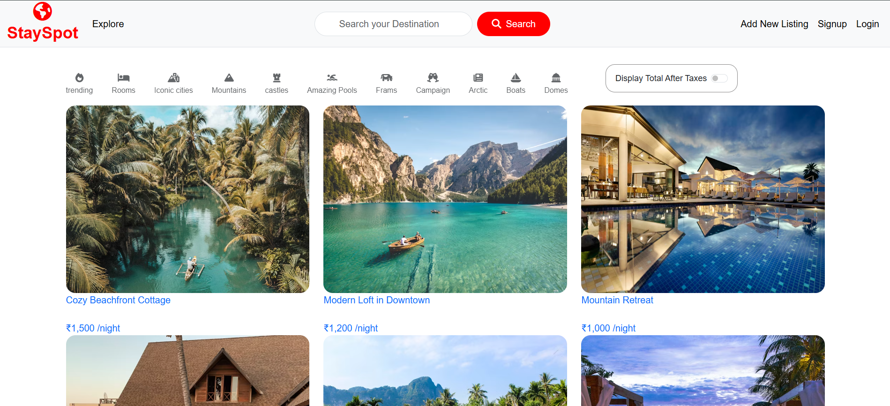

🏡 StaySpot – Full-Stack Rental Listing Web App

📸 Screenshot  

🏡 StaySpot – Rental Listing Platform  
StaySpot is a full-stack MVC rental listing web application that allows users to create, browse, search, and manage property listings.
It features secure authentication, image uploads, interactive maps, and a clean server-rendered architecture using EJS.

🔗 Live Demo: <https://stayspot-4jqj.onrender.com/listings>

✨ Features
- Create, edit, and delete rental listings  
- Secure user authentication and sessions  
- Image uploads with Cloudinary  
- Interactive maps and geocoding  
- MVC architecture with EJS templates  

🛠 Tech Stack
- Node.js, Express.js  
- MongoDB, Mongoose  
- EJS, Bootstrap 5  
- Passport.js  
- Multer, Cloudinary  
- Leaflet.js, LocationIQ  

 
📡 Deployment

MongoDB Atlas

Cloudinary for image storage

Node.js web service

👤 Author
Sampath

🐙 GitHub: https://github.com/sampathkocherla

💼 LinkedIn: https://www.linkedin.com/in/sampath-kocherla-31907a2b8/
